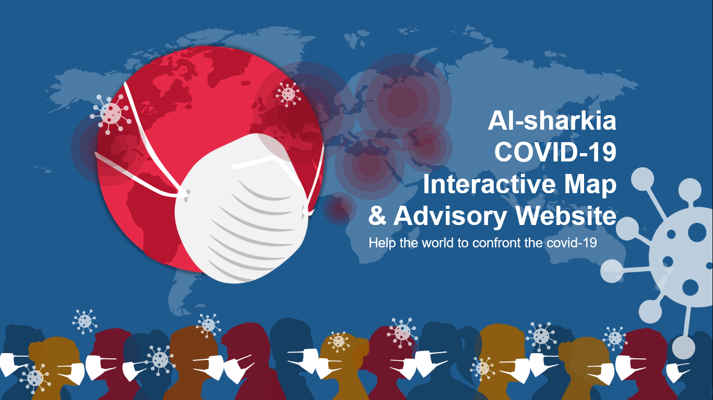

# Al-sharkia-COVID-19-Interactive-Map-Advisory-System

# [ Check it out in more detail here !](https://github.com/MahmoudBakri225/Al-sharkia-COVID-19-Interactive-Map-Advisory-System/blob/main/Al-Sharkia%20COVID-19%20Interactive%20Map%20%26%20Advisory%20Website..pdf)
The dangers of the Corona epidemic threaten both human lives and national economies. Countries face numerous crises and challenges due to the spread of the virus, leading to a rise in infection rates and an increase in global mortality.

So, what are the core problems we have identified? These challenges present opportunities for us to help.

Countries urgently need:

- A large number of doctors for diagnosis and treatment.
- Accessible resources to help patients avoid infection, such as health guidelines, up-to-date news, and tools to locate or reach healthcare facilities, including isolation hospitals and treatment centers recently designated by the government.

### **Scope and Objectives**

- Raise public awareness about precautionary measures to protect against the Coronavirus.
- Provide up-to-date information on the latest COVID-19 news.
- Diagnose patients, assess their condition, determine their infection level, and recommend an appropriate treatment protocol for mild to moderate cases.
- Identify and locate medical facilities, including the nearest available hospitals for patients.
- Reduce the time required for infected individuals to reach medical facilities.
- Monitor hospital capacity to determine available beds for COVID-19 patients.
- Assess hospital readiness to handle emergency COVID-19 cases.

---

